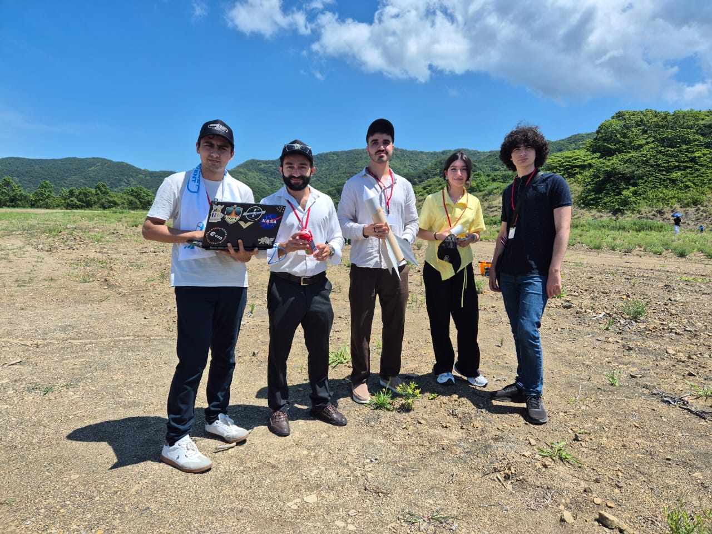
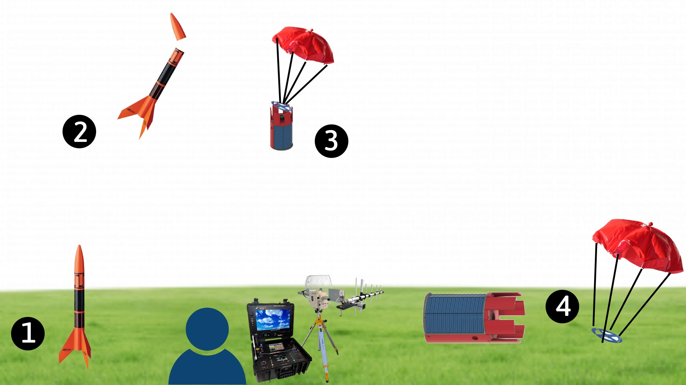
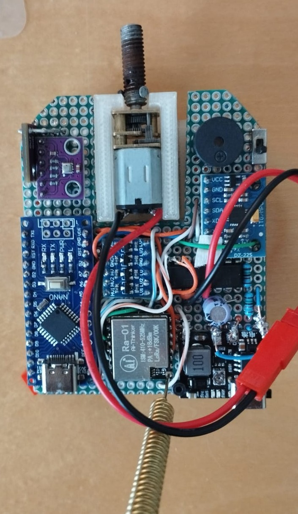
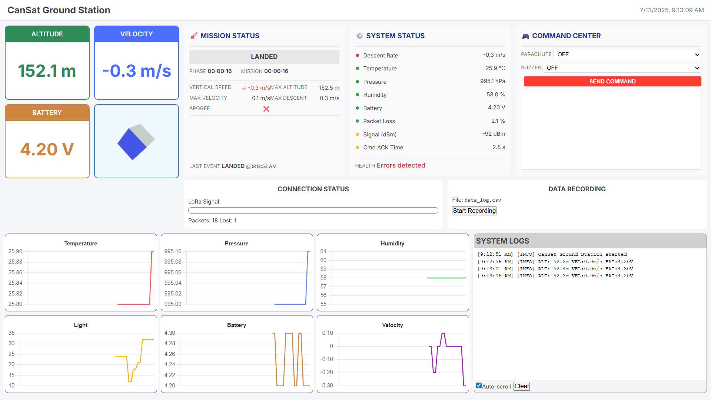

# 🚀 AzSat — Winning CanSat Project from Azerbaijan

Welcome to the official repository of **AzSat**, the winning team representing Azerbaijan at the **APRSAF CanSat Competition 2025** held in **Wakayama, Japan**. Our CanSat was engineered to act as a solar-powered planetary probe, equipped with advanced telemetry, environmental sensors, and autonomous surface operations.



---

## 🚀 Mission Concept

AzSat was developed as a multipurpose probe for **planetary and terrestrial expeditions**. Once deployed from altitude via rocket, it uses a parachute to descend, detaches the parachute upon landing, orients itself using passive stabilization, and begins surface data collection.

🔍 **Applications**:

* Volcanic zones
* Polar and glacial terrain
* Disaster monitoring
* Planetary surface simulations (e.g., Mars)

---

## 🧭 Mission Phases

1. **Pre-Launch** – CanSat preparation, sensor calibration
2. **Ascent** – Mounted on model rocket
3. **Separation & Descent** – Parachute-assisted fall
4. **Landing** – Impact absorption & stabilization
5. **Post-Landing** – Parachute detachment, solar alignment, and data collection

 <!-- Optional -->

---

## ⚙️ Hardware Components

| Component               | Purpose                                                  |
| ----------------------- | -------------------------------------------------------- |
| **Arduino Nano**        | Core microcontroller for all onboard logic               |
| **BME280**              | Pressure, temperature, humidity sensor                   |
| **MPU6050**             | Accelerometer + gyroscope for 3D orientation             |
| **Analog Light Sensor** | Detects ambient lighting or surface exposure             |
| **N20 Motor + L293D**   | Parachute/door actuator system                           |
| **TP4056 + 18650**      | Rechargeable lithium-ion power with charging module      |
| **LoRa RA-01**          | Long-range half-duplex telemetry & command communication |
| **Logic Level Shifter** | Ensures voltage compatibility (3.3V ↔ 5V)                |
| **Voltage Divider**     | Battery voltage measurement via analog pin               |
| **Buzzer**              | Audio feedback system for alarms and location signaling  |
| **Custom PCB**          | Compact, robust electronics layout for space efficiency  |

🖼️ **PCB Design:**
 <!-- Optional -->

---

## 📡 Communication System

Our system uses **LoRa RA-01** in half-duplex mode, ensuring:

* 🔄 Continuous **telemetry transmission** from CanSat
* 📥 Remote **command reception** from the ground station

All data is parsed and visualized in real time using a **Python-based WebSocket server** and a **browser-based ground station UI**.

---

## 🛰️ Telemetry Packet Structure (Satellite → Ground)

Each packet contains environmental and status data encoded for efficient decoding:

```plaintext
<packetID> <teamID> <uptime> <statusFlags> <altitude> <velocity>
<temperature> <humidity> <pressure> <accX,Y,Z> <gyroX,Y,Z>
<light> <parachute> <battery>
```

| Field           | Description                           | Units     | Example          |
| --------------- | ------------------------------------- | --------- | ---------------- |
| `<packetID>`    | Auto-incremented packet number        | —         | `<42>`           |
| `<teamID>`      | Static identifier                     | —         | `<1>`            |
| `<uptime>`      | Time since system boot                | seconds   | `<128>`          |
| `<statusFlags>` | 8-bit flag representing system states | bitfield  | `<18>`           |
| `<altitude>`    | Altitude from barometer               | meters    | `<73.2>`         |
| `<velocity>`    | Vertical velocity                     | m/s       | `<-1.4>`         |
| `<temperature>` | Ambient temp from BME280              | °C        | `<28.4>`         |
| `<humidity>`    | Relative humidity                     | %         | `<41>`           |
| `<pressure>`    | Atmospheric pressure                  | hPa       | `<1009.4>`       |
| `<accX,Y,Z>`    | Accelerometer readings                | m/s²      | `<0.1,0.0,9.8>`  |
| `<gyroX,Y,Z>`   | Gyroscope readings                    | rad/s     | `<-0.1,0.0,0.2>` |
| `<light>`       | Light intensity                       | raw units | `<378>`          |
| `<parachute>`   | Parachute status flag                 | —         | `<0>`            |
| `<battery>`     | Battery voltage                       | volts     | `<4.2>`          |

---

## 🔔 Status Flags (bitfield in `<statusFlags>`)

Each bit of the 8-bit field represents a real-time condition:

| Bit | Name               | Description                                      |
| --- | ------------------ | ------------------------------------------------ |
| 0   | Low Battery        | Battery < 3.3V                                   |
| 1   | Parachute Attached | Parachute not detached yet                       |
| 2   | Buzzer Active      | Audio alert is sounding                          |
| 3   | Sensor Fault       | One or more sensors failed                       |
| 4   | Manual Mode        | Under ground control                             |
| 5   | Data Recording     | Logging is active                                |
| 6   | Command Pending    | Received command queued                          |
| 7   | Critical Error     | High-priority failure (e.g., communication loss) |

These flags trigger UI warnings and ground station audio-visual alarms when critical.

---

## 🎮 Command Packet Structure (Ground → Satellite)

```plaintext
<packetID> <teamID> <buzzer> <parachute>
```

| Field         | Size   | Description                            |
| ------------- | ------ | -------------------------------------- |
| `<packetID>`  | 1 byte | Unique command ID                      |
| `<teamID>`    | 1 byte | Static team ID                         |
| `<buzzer>`    | 1 byte | 2-bit value to control buzzer          |
| `<parachute>` | 1 byte | 2-bit value to detach/attach parachute |

### Accepted Values:

**Buzzer:**

* `0` – No beep
* `1` – Short beep
* `2` – Double beep
* `3` – Long beep

**Parachute:**

* `0` – No action
* `1` – Detach
* `2` – Reattach
* `3` – Reserved

---

## 🔊 Alarm & Feedback Mechanisms

* **Low Battery Alarm** (via Status Flag + buzzer)
* **Landing Confirmation** (post-impact beep)
* **Command Response** (auditory confirmation)
* **Ground Station LED/Color Signals** for:

  * Sensor faults
  * Packet loss
  * Phase transitions (ASCENT → DESCENT → LANDED)

---

## 🌐 Ground Station Interface

A modern browser-based UI displays:

* Telemetry graphs (Temp, Humidity, Pressure, etc.)
* Mission timer and status
* Live 3D orientation view
* Command inputs (buzzer, parachute)
* CSV data logging

 <!-- Optional -->

---

## 🧪 Operational Success Criteria

To consider the mission successful:

* ✅ Full structural integrity upon landing
* ✅ Descent speed within 5–10 m/s
* ✅ Solar charging functionality operational
* ✅ All sensors report accurate data post-landing
* ✅ 2-way LoRa communication maintained
* ✅ Surface data collection sustained for ≥15 minutes

---

## 📊 Physical Specs

| Spec              | Value         |
| ----------------- | ------------- |
| Length            | 124 mm        |
| Diameter          | 64 mm         |
| Total Mass        | 252 g         |
| Drop Speed        | \~5.2 m/s     |
| Battery Capacity  | 2400 mAh      |
| Operating Voltage | 3.7V (Li-ion) |

---


## 🏅 Recognition

> **🏆 Winner – APRSAF CanSat Competition 2025**
> Representing the Republic of Azerbaijan 🇦🇿

---

## 👤 Team

* **Toghrul Guluzade** – Team Leader / Core Engineering
* **Samir Bairamov** – Mentor
* **Malak Baghirova**
* **Safarali Safarli**
* **Imran Karimov**

---

## 📜 License

MIT License – free to use, learn from, and modify. See [`LICENSE`](LICENSE).

---

## 🧠 Acknowledgments

Special thanks to:

* **Azercosmos Space Academy** – for continuous mentorship, training, and support
* **APRSAF CanSat Competition Organizers** – for the opportunity and an unforgettable international platform in **Wakayama, Japan**
* Our supportive mentors, engineers & advisors
